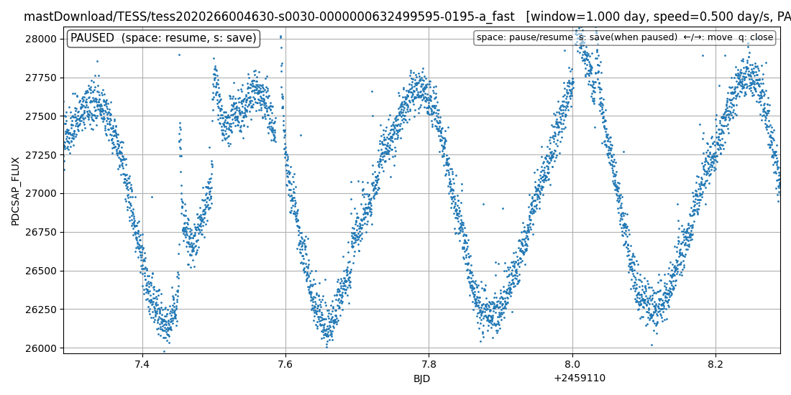

# ql_tesslc
天体名からTESSの測光データを探してダウンロードし、光度曲線をクイックルック表示し、自動でスクロールする。フレア現象などの以上を目視で確認するのに適している。

最も簡単な使い方

python3 ql_tesscl.py "UV Cet"

ある場面。複数のフレアが出現しているのがわかる。

自動スクロールする様子の動画
[自動スクロールする様子の動画](https://github.com/ohshimaosamu/ql_tesslc/raw/main/images/scan_lcfits.mp4)

次のように何も引数を付けなければ、オプションなどの使い方が表示される。

python3 ql_tesscl.py

sage: ql_tesslc.py [-h] [-s SPEED] [-w WINDOW] [--intermittent]
                    [--save-dir SAVE_DIR] [--redownload]
                    target

# 実行例（Linux）

$ python ~/python_prog/ql_tesslc.py "UV Cet"

/home/xxx/xxx/lib/python3.13/site-packages/lightkurve/prf/__init__.py:7: UserWarning: Warning: the tpfmodel submodule is not available without oktopus installed, which requires a current version of autograd. See #1452 for details.

  warnings.warn(
[INFO] input interpreted as SIMBAD object name: UV Cet

[INFO] resolved TIC: 632499595

[INFO] TIC was resolved directly from SIMBAD identifiers.

[INFO] target: TIC 632499595

[INFO] download dir: ./TIC632499595

[INFO] author=SPOC: 4 entries found

[INFO] author=SPOC: downloaded 4 files

[INFO] author=TESS-SPOC: 1 entries found

[INFO] author=TESS-SPOC: downloaded 1 files

[INFO] author=QLP: 2 entries found

[INFO] author=QLP: downloaded 2 files

[INFO] total downloaded entries: 7

表示する lcfits を選んでください

--------------------------------------------------

  1 : mastDownload/HLSP/hlsp_qlp_tess_ffi_s0030-0000000632499595_tess_v01_llc
  
  2 : mastDownload/HLSP/hlsp_qlp_tess_ffi_s0097-0000000632499595_tess_v01_llc
  
  3 : mastDownload/HLSP/hlsp_tess-spoc_tess_phot_0000000632499595-s0030_tess_v1_tp
  
  4 : mastDownload/TESS/tess2020266004630-s0030-0000000632499595-0195-a_fast
  
  5 : mastDownload/TESS/tess2020266004630-s0030-0000000632499595-0195-s
  
  6 : mastDownload/TESS/tess2025258001959-s0097-0000000632499595-0294-a_fast
  
  7 : mastDownload/TESS/tess2025258001959-s0097-0000000632499595-0294-s
  
  q : 終了
  
--------------------------------------------------

選択番号または q を入力してください: 6

以上を実行した時の様子

